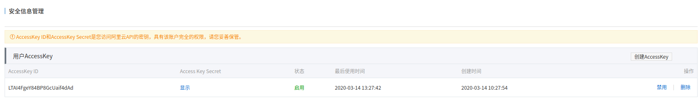

# DDNS服务功能实现

## 描述
此脚本主要利用阿里云的DNS-SDK将动态公网IP解析到固定域名，起到DDNS服务的作用

[AcsClient.py](./AcsClient.py) 主要实现验证连接:

__AccessKeyId       AccessKey的ID \
__AccessKeySecret  AccessKey的密钥 

[Utils.py](./Utils.py)  工具类主要实现公网IP获取、DNS解析信息、更新DNS解析信息

[DDNSServer.py](./DDNSServer.py) 主要实现判断当前公网IP是否与DNS解析信息IP是否一致，若不一致则进行DNS解析信息的更新

